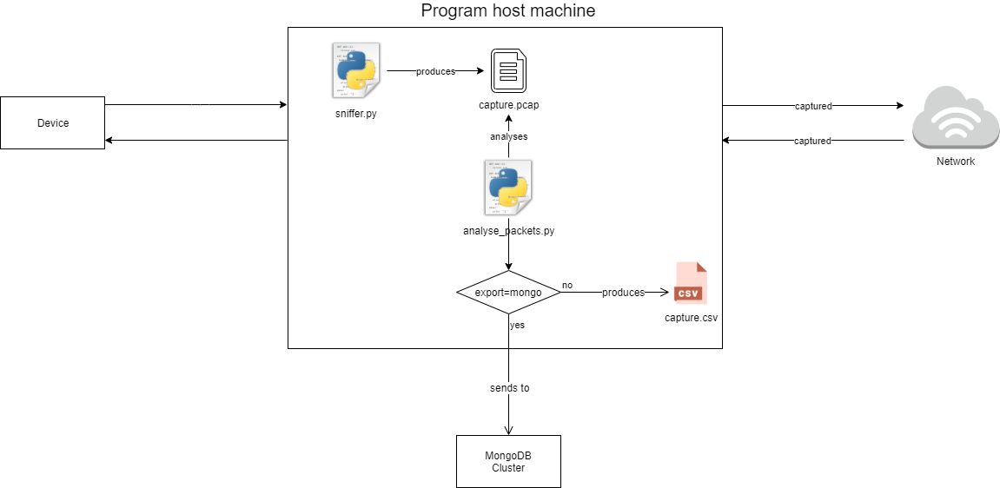

# Capitrain

## Table of Contents

*	[Installation](#installation)
* [Usage](#usage)
* [Environment variables](#environment-variables)
*	[Context and problem to solve](#context-and-problem-to-solve)
*	[Explored possibilities and solution provided](#explored-possibilities-and-solution-provided)
*	[Results](#results)

## Installation

* TShark installed
* Python 3 installed
* Run `pip3 install -r requirements.txt`

## Usage

To sniff data: 
 * Add in the .env file the values for `LISTENED_IP`, `LOCAL_IP` and `INTERFACE`
 * Run `python3 sniffer.py`, you can also provide different options, run `python3 sniffer.py -h` to see them
 * By default the program will generate a `capture.pcap` file in the root folder

To analyse sniffed data:
  * Run `python3 analyse_packets.py`, you can also provide different options, run `python3 analyse_packets.py -h` to see them
  * If you choose the "mongo" export mode, you need complete the variables about mongoDB in the .env file
  * By default the program will generate a `results.csv` file in the root folder

### Schema

## Environment variables

### Sniffer

These variables are used for sniffing

* INTERFACE : name of the network interface to listen
* LISTENED_IP : script will capture packets from conversation between LISTENED_IP and other addresses
* LOCAL_IP : IP of the program host machine
* LISTENED_IPV6 (optional) : script will capture packets from conversation between LISTENED_IPV6 and other addresses
* LOCAL_IPV6 (optional) : IPv6 of the program host machine

LISTENED_IP (or LISTENED_IPV6) and LOCAL_IP (or LOCAL_IPV6) can be the same if you want to capture packets from conversation between the program host machine and and other addresses

### MongoDB

These variables are only used for analysing in "mongo" export mode

* MONGO_CLUSTER_ADDRESS
* MONGO_DB_NAME
* MONGO_DB_USER
* MONGO_DB_PASSWORD

## Context and problem to solve

The number, type and size of objects we exchange via the Internet have continued to evolve since the 2000s. We share on a daily basis and without realizing it a multitude of complex objects and in large numbers. Network players have predicted an explosion of these and alerted to the need for early implementation of new mechanisms capable of meeting this growing demand.

Several systems to improve the sharing and exchange of data are being studied. Unfortunately, the experimental validation is achieved by using arbitrary models based on projections hypothetical of what data exchanges are and could be.

There is currently no tool available to extract in an agnostic way a model of the objects exchanged for all the applications that we can use on a daily basis.

The objective is to design and develop a tool to collect and analyse information on any type of data transfer to and from a client workstation.

## Explored possibilities and solution provided

### MITM attack with a Proxy

Work based on:

#### Articles on proxy:
  * https://www.nextinpact.com/news/106364-avec-pirogue-capturer-trafic-https-dun-smartphone-devient-plus-simple.htm
  * https://www.intellectsoft.net/blog/monitor-mobile-app-traffic-with-sniffers/
  * https://null-byte.wonderhowto.com/how-to/use-charles-proxy-view-data-your-mobile-apps-send-receive-0185364/

#### Articles on SSL Certificate Pinning
  * https://v0x.nl/articles/bypass-ssl-pinning-android/
  * https://ninadmathpati.com/all-about-ssl-pinning-bypass/
  * https://github.com/nabla-c0d3/ssl-kill-switch2
  * https://medium.com/bugbountywriteup/how-to-bypass-certificate-validation-ssl-pinning-ef8af8b15c40

// TODO:

### Network sniffer with a TShark wrapper

Work based on:
  * https://www.geeek.org/iphone-analyse-trafic-reseau-application-mobile-ios-177/
  * https://ask.wireshark.org/question/7432/how-to-find-size-of-file-downloaded/

Librairies:
  * https://pypi.org/project/pyshark/
  * https://pypi.org/project/pymongo/
  * https://pypi.org/project/dnspython/
  * https://pypi.org/project/python-dotenv/

// TODO:

## Results

// TODO: add CSV parts

A mongoDB dump of our results is available in the [results folder](results/), these results are based on the [capture.pcap](results/capture.pcap) file which is the file generated by [pyshark](https://github.com/KimiNewt/pyshark) of all the packets we received during one day from a smartphone device.

Charts based on these results:

// TODO: insert our charts
